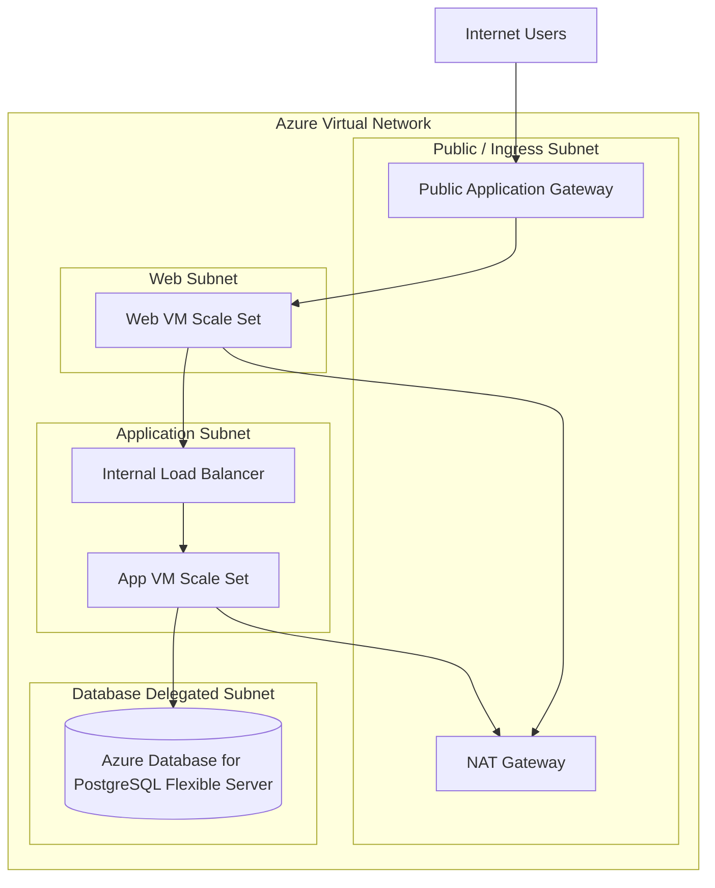

# Azure HA Three-Tier Web Architecture

Production-oriented three-tier Azure architecture for a highly available web application deployed across multiple Availability Zones.

## Architecture



The design provides:

- High availability across Azure Availability Zones
- Public and private subnet isolation
- Internet-facing Application Gateway and internal load balancing
- Private VM Scale Sets for web and application tiers
- Zone-redundant Azure Database for PostgreSQL Flexible Server
- NAT Gateway for controlled outbound access
- Least-privilege Network Security Groups
- Managed identities, Key Vault secrets, and encryption

## Project Structure

```text
.
├── README.md
├── docs/
│   ├── architecture-diagram.md
│   └── SECURITY-DESIGN.md
└── terraform/
    ├── *.tf
    └── user-data/
```

## Documentation

| Document | Description |
| :--- | :--- |
| [Architecture Diagram](./docs/architecture-diagram.md) | VNet, subnet, zone, load-balancing and tier architecture |
| [Security Design](./docs/SECURITY-DESIGN.md) | NSGs, ports, managed identities, secrets and encryption |
| [Terraform](./terraform/README.md) | Infrastructure as Code implementation |

## Terraform

Terraform is being used to implement the documented architecture. While the architecture and design decisions are established first, the Terraform implementation is currently ongoing and being hardened.

```bash
cd terraform

terraform init
terraform fmt -recursive
terraform validate
terraform plan
```

## Key Design Principles

- High availability
- Network isolation
- Least privilege
- No direct Internet access to VMs or PostgreSQL
- Secure credential management
- Encryption at rest and in transit
- Infrastructure as Code
