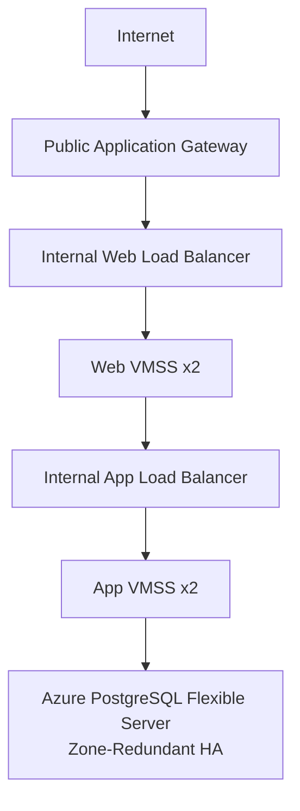

# AWS to Azure Mapping

| AWS | Azure Implementation | Key Difference |
| :--- | :--- | :--- |
| **VPC** | Azure Virtual Network (VNet) | Both provide isolated regional networking; Azure commonly uses subnet delegation and private DNS integrations for PaaS services. |
| **EC2** | Azure Virtual Machines / VM Scale Sets | EC2 is an individual VM service; VM Scale Sets manage a fleet and are the closer equivalent to an EC2 Auto Scaling Group. |
| **ALB** | Azure Application Gateway | AWS ALB is a managed Layer-7 load balancer; Application Gateway provides Layer-7 HTTP(S) routing and optional WAF. |
| **Internal ALB** | Azure Standard Load Balancer | Azure Standard Load Balancer is Layer 4; use another Application Gateway if internal Layer-7 routing is required. |
| **RDS PostgreSQL** | Azure Database for PostgreSQL Flexible Server | Both are managed PostgreSQL services; Azure Flexible Server exposes zone-redundant HA explicitly through primary and standby zones. |
| **Security Groups** | Azure Network Security Groups (NSGs) | AWS SGs are attached to ENIs/instances; Azure NSGs can be associated with subnets or NICs. |
| **NAT Gateway** | Azure NAT Gateway | Azure NAT Gateway is associated with subnets and provides managed outbound SNAT. |
| **IAM Roles** | Azure Managed Identities + RBAC | AWS roles are assumed by resources; Azure managed identities provide an Azure-managed identity whose permissions are assigned through Azure RBAC. |
## Equivalent Architecture



The additional internal web load balancer provides a stable backend endpoint for the Application Gateway while VM Scale Set instance IPs remain dynamic.

The logical three tiers remain:

```plaintext
Web ──> Application ──> Database
```
