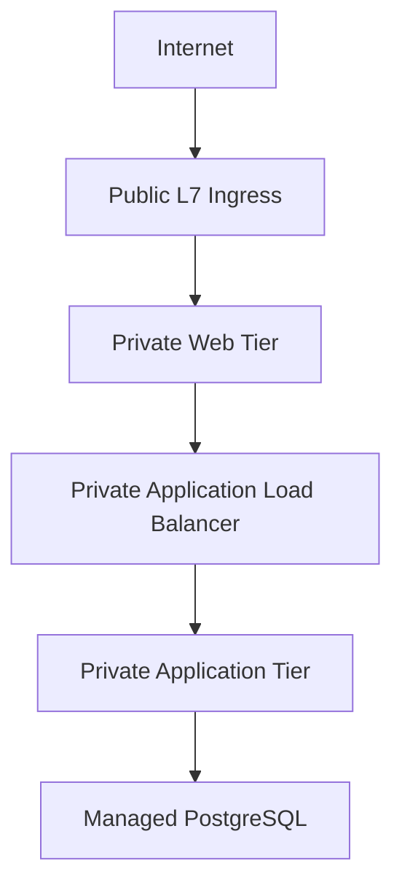

# AWS vs Azure Comparison

  

## Where Azure is stronger

  

### 1. Microsoft identity integration

Azure Managed Identities and Microsoft Entra ID integrate naturally with Azure resources and Microsoft 365 environments. Applications can receive Azure resource permissions without storing long-lived cloud credentials.

  

### 2. Integrated enterprise platform

Application Gateway, VM Scale Sets, Key Vault, Azure Monitor and PostgreSQL Flexible Server form a cohesive platform. Application Gateway can also provide WAF functionality without introducing a separate load-balancer product.

  

## Where AWS is stronger

  

### 1. Broad cloud-native service ecosystem

AWS has an exceptionally broad set of infrastructure and managed-service primitives. The ALB + EC2 Auto Scaling + RDS pattern is mature and widely used.

  

### 2. Infrastructure flexibility

AWS exposes many alternative compute, networking and database patterns. Teams with strong Linux, Kubernetes and AWS operational maturity often benefit from the depth of the AWS ecosystem.

  

## Recommendation

  

For an organisation already invested heavily in Microsoft 365, Entra ID and Azure operations, I would recommend **Azure** for a new project of this type. Managed identities, Key Vault, Application Gateway and Azure Database services reduce integration friction.

  

For a Linux/cloud-native organisation with established AWS expertise, AWS remains an excellent choice and may be preferable where AWS-native services are already part of the platform.

  

### Cloud-Neutral Architecture Principle

The underlying architecture remains consistent regardless of the cloud provider:

The cloud provider changes the implementation, but the core design remains:

**Public L7 Ingress → Private Web Tier → Private Application Load Balancing → Private Application Tier → Managed PostgreSQL**