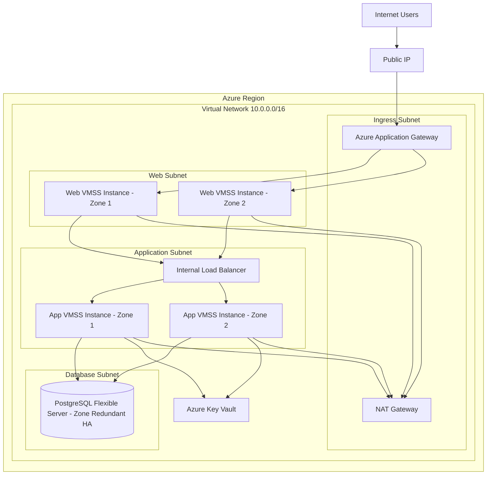

# Azure Architecture Diagram

## Tier Mapping

| AWS concept | Azure equivalent |
| :--- | :--- |
| VPC | Virtual Network |
| Public subnet | Application Gateway ingress subnet |
| Private web subnet | Web subnet with VM Scale Set |
| Private app subnet | Application subnet with VM Scale Set |
| DB subnet group | Delegated PostgreSQL subnet |
| Public Application Load Balancer | Azure Application Gateway |
| Internal Application Load Balancer | Internal Azure Load Balancer |
| EC2 Auto Scaling Group | Virtual Machine Scale Set |
| RDS PostgreSQL Multi-AZ | Azure Database for PostgreSQL Flexible Server with zone-redundant HA |
| Security group | Network Security Group |
| Secrets Manager | Azure Key Vault |
| IAM instance profile | User-assigned managed identity |

## Traffic Flow

1. Internet users reach the public Application Gateway.
2. Application Gateway then forwards HTTP traffic to the private web VM Scale Set.
3. Web instances proxy application traffic to the internal Load Balancer on port `3000`.
4. The internal Load Balancer sends traffic to the private application VM Scale Set.
5. Application instances connect to PostgreSQL on port `5432`.
6. Web and application instances use NAT Gateway for controlled outbound HTTPS.

## Availability

The web and application VM Scale Sets span multiple Availability Zones where the selected region supports them. PostgreSQL Flexible Server is configured with zone-redundant high availability.
